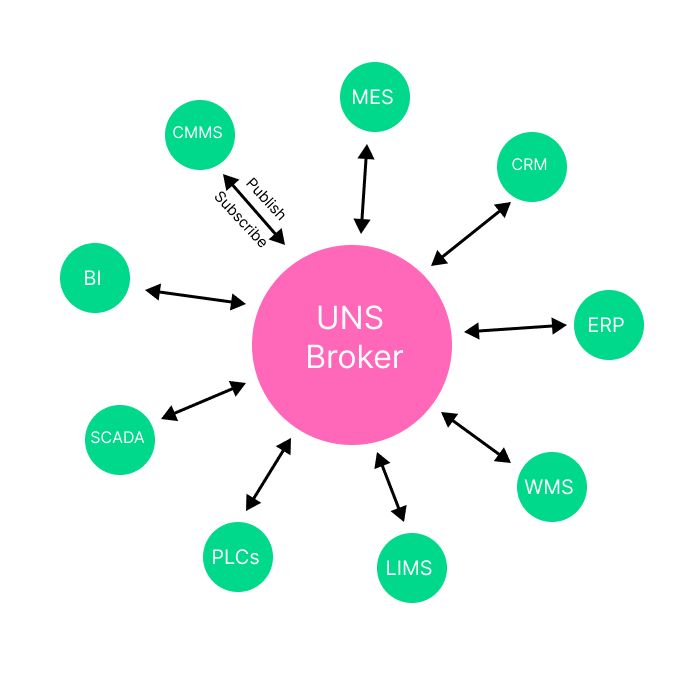

<p align="center">
  <a href="" target="blank"></a>
</p>

Vechr (Manufacturing Execution System). This is Under [Vechr](LICENSE).

# Importance Concepts
The concep of this application is use UNS (Unified Namespace) as big node of the data. 

## Unified Namespace IIoT

<p align="center">
  <a href="" target="blank"></a>
</p>

Unified Namespace is an extended event-driven architecture, in which all data gets published regardless of whether there is an actual consumer or not. We leverages MQTT/NATS as a central message broker.

## ISA-95

<p align="center">
  <a href="" target="blank"></a>
</p>

If we compare with ISA-95, the data will flow from the Bottom (PLC) to the until Upper (Cloud), this is industry 3.0, In Industry 3.0 setups the general dataflow would be somewhat linear and would only flow in one direction: From the sensors to the PLC to SCADA and MES to the ERP. With a unified this would be much more connected, so if we compare with UNS, (ERP, SCADA, etc) we can say **node** and node will publish and consume the data from UNS system, so this will achieve integration more easy.

# Architecture Diagram

<p align="center">
  <a href="" target="blank"></a>
</p>

# Setup Application (Production)

Make sure you already setup kubernetes cluster

```bash
cd kubernetes
./install.sh
```

# Setup Application (Development)
Before pulling you'll need to all **access** for submodule repository.

## Pull repository
```
git clone --recursive git@github.com:vechr/vechr-atlas.git
```

Edit `.env` file, configure `APP_LISTS`, this line will decided what are the list of container that you'll run.
```
APP_LISTS=web-app,notification-service,db-logger-service,things-service,mail-dev,konga,konga-prepare,kong,postgres-db,pg-admin4,influxdb,nats-server,mosquitto
```
## Allowing Script
Script must be have an access before executing
```
chmod 777 scripts/
chmod 777 ./dockerfiles/database/postgres/create-multiple-db.sh
```

# Running Application

## Running All Container
```bash
./dockerfiles/kong/setup-notification.sh
./dockerfiles/kong/setup-things.sh
./up.sh
```

# Setup Account Kong
Go to `http://localhost:1337`
1. Create your account
2. Login
3. Setup the connection with the kong, in this case we use `http://kong:8001` as a kong admin API

## Stoping All Container
```bash
./down.sh
```

## Logs container
```bash
#example
./logs.sh influxdb
```

## SSH to container
```bash
#example
./ssh.sh nats-box
```

# Testing NATS with MQTT (Start Publish Subscribe)
Open 4 terminal, and run each command below

## Subscribe to MQTT topic on Terminal 1
This command will listen on topic `NATS/MQTT/Test/#` mqtt
```bash
# ssh to container
./ssh.sh "mosquitto"
# Subscribe message
/scripts/mqtt-sub.sh
# or using this instead mqtt-sub.sh
mosquitto_sub -h nats-server -p 1883 -t "NATS/MQTT/Test/#"
```

## Subcribe to NATS Subject on Terminal 2
This command will listen on subject `NATS.MQTT.Test/>` nats
```bash
# ssh to container
./ssh.sh "nats-box"
# Subscribe message
nats -s nats://nats-server sub "NATS.MQTT.Test.>"
```

## Publish to NATS subject on Terminal 3
You can execute this command several time
```bash
# ssh to container
./ssh.sh "nats-box"
# Publish message
nats -s nats://nats-server pub "NATS.MQTT.Test.>" "This is message from nats"
```

## Publish to MQTT topic on Terminal 4
You can execute this script several time
```bash
# ssh to container
./ssh.sh "mosquitto"
# Publish message
/scripts/mqtt-pub.sh
#or using this instead mqtt-pub.sh
mosquitto_pub -h nats-server -p 1883 -t "NATS/MQTT/Test/" -m "This is message from mqtt"
```


## Publish MQTT Data
Please use this topic format to store in database
`Vechr/DashboardID/<Your Dashboard ID>/DeviceID/<Your Device ID>/topic/<Your Topic Name>`
```bash
mosquitto_pub -h nats-server -p 1883 -t "Vechr/DashboardID/87jk234/DeviceID/9jk2b2189/topic/temp" -m "80.23"
```

## Query Data using Rest API
Using curl
```bash
curl -X GET http://localhost:3000/logger/query \
   -H 'Content-Type: application/json' \
   -d '{"dashboardId": "87jk234", "deviceId": "9jk2b2189", "topic": "temp"}'
```

Or you can use [OpenAPI Swagger UI](http://localhost:3000/api)